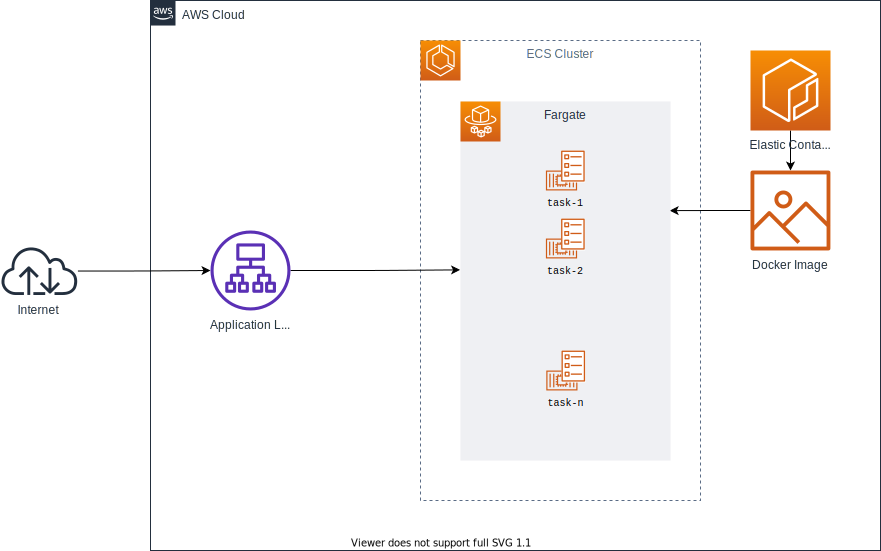

# Trip Analyzer

## Deliverables
- Implemented the specified [REST Endpoint](assets/architecture/architecture.svg) which allows the client to Execute service call for Post. aws Url/v1/trip 
- BasicAuth using (name/password: demo/demo). Internal service [AuthenticationService](src\TripAnalyzer.Api\Middleware\AuthenticationService.cs) is created to handle authenticationand it can be extended.
- Use Docker to run your application run command
``` docker-compose up --build ```
- Using C# language & .Net Core
- Automate the infrastructure rollout
  * AWS
  * Using Terraform
  * Using GitHub Actions
- [google apis](src\TripAnalyzer.Api\GoogleApiClient\GoogleApiClient.cs) is used to determine the city name for depature and destination
- Provide a link to the secured hosted instance of your solution together with a username and a password.
  * I used AWS.
  * GitHub actions can deploy at any time to My AWS Account.
  * Run [bootstrap work flow at Github](https://github.com/amabdelmongy/trip-analyzer/actions/workflows/bootstrap.yml)
- Provide the following files together with your code in the github repository&#58;
  * [Dockerfile](docker-compose.yml)
  * Build-Script just run `dotnet build "src/TripAnalyzer.Api/TripAnalyzer.Api.csproj"`
  * [Deployment-Script](.github\workflows\bootstrap.yml)
  * [Infrastructure automation scripts](terraform\main.tf)
  * README.md with documentation how to deploy the infrastructure and the application
This API Service is able to work with Json formatted input and it supports HTTP/HTTPS as messaging protocol.

## Technology
- .NET core 6
- Swagger
- NUnit
- Moq
- Docker
- Terraform
- GitHub Actions
- AWS
  * Region
  * Availability Zones
  * VPC
  * ALB
  * ECS
  * ECR
  * S3


### Infrastructure

The required `terraform` version for this repository is v1.0.2. The architecture built from this code is below.




## AWS Docker Deploy to Fargate
I am using a containerized cloud architecture with a Fargate-managed ECS cluster. Deploying Fargate tasks into the private subnet due to security reasons.

The Appliaction Load Balancer to scale in and scale out depend on CPU usage.
Could scale to 5 tasks and start by 2 tasks. It appended on the Internet Gateway, will forward incoming HTTP requests to the Fargate tasks.

The services deployed in the private subnet will use the NAT Gateway in order to connect to services outside of the VPC. The application is highly available, because it is deployed in two different availability zones.


## GitHub Action

This repository is meant to be managed through GitHub Action as the main CI/CD pipeline.

The initial bootstrapping should be done by running the [bootstrap](.github/workflows/bootstrap.yml) workflow. This will initialize the ECR registry, push the initial Docker image, and then apply the remaining infrastructure, deploying the Docker image to ECS.

Subsequent changes can be applied by running the [push_to_ecr](.github/workflows/push_to_ecr.yml) workflow.

Docker Image is published to S3 Then Fargate is usign this image.

I am using GitHub Actions to lay the CI/CD groundwork to automatically deploy application changes to ECR and redeploy the ECS cluster with updates.

## Terraform
### Manual run of terraform commands

If you don't use a CI/CD Pipeline, you need to run the terraform commands manually.

- `terraform init`
- `terraform plan`
- `terraform apply`

The first command `terraform init` will initialized the backend and import external modules.
The second command `terraform plan` will show you the possible deletions, changes & creations of resources before applying it.
For the third command `terraform apply` you need to press yes, if the plan looks good to you.

## Code Architecture
### Onion architecture
The Onion Architecture is an Architectural Pattern that enables maintainable and evolutionary enterprise systems.

* Api contains
  - [trip controller](src\TripAnalyzer.Api\Controller\v1\TripController.cs)
  - [Google map Api client](src\TripAnalyzer.Api\GoogleApiClient\GoogleApiClient.cs)
* Domain layer contains all logic
  - [Aggregate](src\Domain\Aggregate\VehiclePushAnalysisAggregate.cs)

### Unit tests
 It validates if that code results in the expected state (state testing) or executes the expected sequence of events (behavior testing).
 It covers a lot of code areas.

### Integration tests
individual software modules are combined and tested as a group

### Swagger documentation
  - Swagger generate file for last version of api under this link ```/swagger/v1/swagger.json```

##  How to run the code
To start the internal service and its dependencies locally, execute:
the file docker-compose.yml will be under api folder direct.
```
    docker-compose up --build
```

## Excute the code 
BasicAuth name/password: demo/demo.
Using API url Post action ```/v1/trip```
  Input
```
  {
      "vin": "15591380201559138020",
      "breakThreshold": 1800,
      "gasTankSize": 100,
      "data": [
          {
              "timestamp": 1559138020,
              "odometer": 0,
              "fuelLevel": 100,
              "positionLat": 48.77199,
              "positionLong": 9.172787
          },
          {
              "timestamp": 2559138020,
              "odometer": 10000,
              "fuelLevel": 50,
              "positionLat": 49.77199,
              "positionLong": 9.172787
          },
          {
              "timestamp": 4559138020,
              "odometer": 10000,
              "fuelLevel": 100,
              "positionLat": 49.77199,
              "positionLong": 9.172787
          },
          {
              "timestamp": 5559137022,
              "odometer": 500000,
              "fuelLevel": 85,
              "positionLat": 52.471870,
              "positionLong": 13.464450
          }
      ]
  }
```
          Http status 200 Ok
```
{
    "vin": "15591380201559138020",
    "departure": "Sophienstraße 21, 70178 Stuttgart, Germany",
    "destination": "Aronsstraße 128, 12057 Berlin, Germany",
    "refuelStops": [
        {
            "startTimestamp": 2559138020,
            "endTimestamp": 4559138020,
            "positionLat": 49.77199,
            "positionLong": 9.172787
        }
    ],
    "consumption": 13,
    "breaks": [
        {
            "startTimestamp": 2559138020,
            "endTimestamp": 4559138020,
            "positionLat": 49.77199,
            "positionLong": 9.172787
        }
    ]
}
```

## ToDo
1. Add more unit tests and E2E tests
2. Add more functionallity from Google map like for every location for every break.
